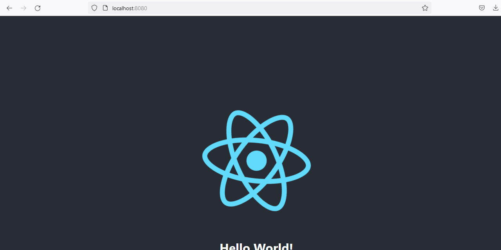
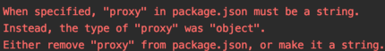

## Summary

A template for creating Spring Boot applications with a React.js frontend that both start from the "localhost:8080/". This will serve as a starting point for building my own React w/ Spring Boot applications in the future.

<p align="center"></p>

## Inspiration

This project was inspired by the following article by <em>Emmanuella Aninye</em>.<br>
Github: https://github.com/Emmanuella-Aninye <br>
Article: https://medium.com/analytics-vidhya/how-to-package-your-react-app-with-spring-boot-41432be974bc

## Technologies

Front-End:
- HTML, CSS, JavaScript, React.js

Back-End:
- Spring Boot

Frameworks:
- Node.js 
- Maven
- Java

## Issues

During the build process, I ran into several issues with the instructions offered on the above link. They are as follows:
- Proxy settings in the "package.json":
>Swapped from the below:
>```
>"proxy": {
>    "/api": {
>      "target": "http://localhost:8080",
>      "ws": true
>    }
>  },
>```
> To:
> ```
>"proxy": "http://localhost:8080",
>```

- The below error was corrected not by deleting "my package-lock.json file and node_modules folder" and "reinstalled npm packages". The problem seemed to be related to my npm version. To correct the issue I  identified my currently installed version of Node.js and the associated npm and updated that information in the pom.xml file. 
<p align="center"></p>